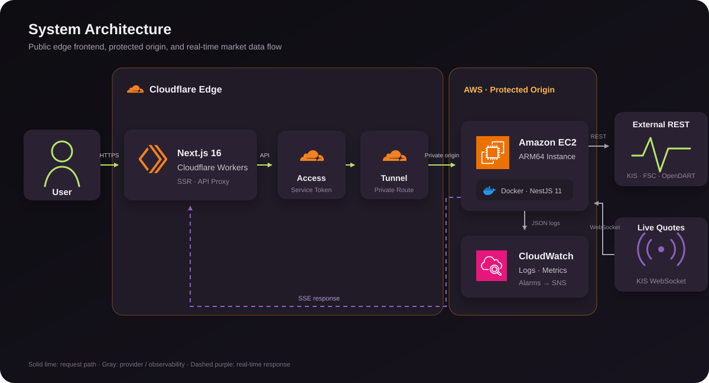
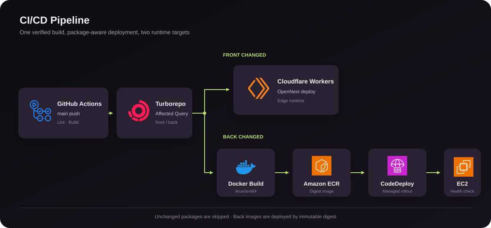

# 그때 샀다면

**과거에 샀던 주식이 지금 얼마가 되었을지 계산하고, 그 결과를 가볍게 공유하는 주식 회고 서비스**

[서비스 바로가기](https://ittaesalgeol.com) · [제품 문서](./PRODUCT.md) · [기술 결정 기록](./docs/adr)

> 기능을 나열하는 데 그치지 않고, 타입 안전한 API 계약과 실시간 데이터 처리, 보호된 백엔드 origin, 변경 범위 기반 배포까지 하나의 시스템으로 설계했습니다.

## System Architecture

프론트엔드는 Next.js를 Cloudflare Workers에서 실행합니다. 브라우저의 API 요청은 프론트엔드 프록시를 통과하며, 프록시가 Cloudflare Access service token을 추가해 Tunnel 뒤의 백엔드 origin에 접근합니다. 따라서 AWS EC2의 백엔드 애플리케이션은 공개 inbound로 직접 노출되지 않습니다.

NestJS 백엔드는 외부 금융 데이터 REST API와 KIS WebSocket 연결을 관리합니다. 실시간 체결 정보는 백엔드에서 SSE로 변환해 클라이언트에 전달하고, 애플리케이션 로그와 운영 지표는 CloudWatch에서 수집합니다.

## Engineering Highlights

| 주제                   | 설계                                                                                                                                                                                                                                                            |
| ---------------------- | --------------------------------------------------------------------------------------------------------------------------------------------------------------------------------------------------------------------------------------------------------------- |
| **외부 API 계약**      | KIS, 금융위원회, OpenDART의 REST 계약을 `back/openapi/{provider}/rest/openapi.json`에 한 번 정의하고 mock 시나리오는 `overlay.yaml`로 분리합니다. Orval이 실제 호출과 응답 검증에 사용하는 `api.ts`, 개발 mock용 `api.msw.ts`, `api.scenarios.ts`를 생성합니다. |
| **내부 API 계약**      | NestJS DTO와 Zod 스키마에서 `packages/api-client/openapi.json`을 생성하고, 이를 입력으로 프론트엔드 클라이언트를 생성합니다. 요청·성공 응답뿐 아니라 endpoint별 실패 타입도 API 계약에 포함하며 생성 결과는 직접 수정하지 않습니다.                             |
| **명시적인 오류 흐름** | 예상 가능한 도메인 실패와 외부 연동 실패를 `neverthrow`의 `Result`로 유지합니다. HTTP 경계에서만 공개 오류 응답으로 변환해 내부 오류와 클라이언트 계약을 분리합니다.                                                                                            |
| **실시간 연결 경계**   | 외부 WebSocket의 인증, 구독, 재연결과 장애 전파는 백엔드가 담당합니다. 브라우저에는 단방향 SSE 계약만 노출해 외부 공급자 구현을 클라이언트에서 격리합니다.                                                                                                      |
| **보호된 origin**      | 공개 트래픽은 Cloudflare에서 받고, 백엔드는 Access와 Tunnel을 통해서만 접근합니다. 런타임 비밀값은 저장소 밖에서 관리하고 EC2 origin은 공개 네트워크에 직접 노출하지 않습니다.                                                                                  |
| **패키지 단위 배포**   | GitHub Actions에서 Turborepo의 affected 결과를 사용해 변경된 `front` 또는 `back`만 배포합니다. 공통 빌드 검증은 한 번 수행하고 런타임별 배포 경로만 분기합니다.                                                                                                 |
| **운영 관측성**        | 요청마다 Request ID를 부여해 응답과 JSON 로그를 연결합니다. CloudWatch에서 로그, 인스턴스 자원, 5xx 지표를 수집하고 SNS 알람으로 전달합니다.                                                                                                                    |

## Infrastructure &amp; Deployment

`main` 브랜치가 변경되면 GitHub Actions가 워크스페이스를 검증한 뒤 영향받은 패키지를 판별합니다. 프론트엔드는 OpenNext를 통해 Cloudflare Workers로 배포하고, 백엔드는 ARM64 Docker 이미지를 ECR에 저장한 뒤 CodeDeploy가 이미지 digest를 기준으로 EC2 컨테이너를 교체합니다.

## Tech Stack

| 영역               | 기술                                                                  |
| ------------------ | --------------------------------------------------------------------- |
| **Frontend**       | TypeScript, Next.js 16, React 19, TanStack Query, Tailwind CSS 4, Zod |
| **Backend**        | TypeScript, NestJS 11, RxJS, Zod, neverthrow                          |
| **Realtime**       | WebSocket, Server-Sent Events                                         |
| **API Contract**   | OpenAPI, OpenAPI Overlay, Swagger, Orval, Generated Type-safe Client  |
| **Workspace**      | pnpm Workspace, Turborepo                                             |
| **Testing**        | Vitest, Playwright, MSW                                               |
| **Infrastructure** | Cloudflare Workers, Access, Tunnel, AWS EC2, ECR, CodeDeploy, Docker  |
| **Observability**  | CloudWatch Logs, Metrics, Alarms, SNS                                 |
| **CI/CD**          | GitHub Actions, Turborepo Affected                                    |

## Technical Decisions

- [외부 시장 데이터 공급자를 도메인 경계 밖으로 분리](./docs/adr/0001-market-data-provider-boundary.md)
- [예상 가능한 실패를 공개 API 오류 계약으로 모델링](./docs/adr/0002-public-api-error-contract.md)
- [OpenAPI에 오류 코드별 구체적인 스키마 생성](./docs/adr/0005-openapi-code-specific-error-schemas.md)
- [Cloudflare와 AWS의 런타임 및 보안 경계 분리](./docs/adr/0006-cloudflare-aws-deployment-boundary.md)
- [외부 REST 계약의 단일 기준 정의](./docs/adr/0007-external-rest-contract-source.md)
